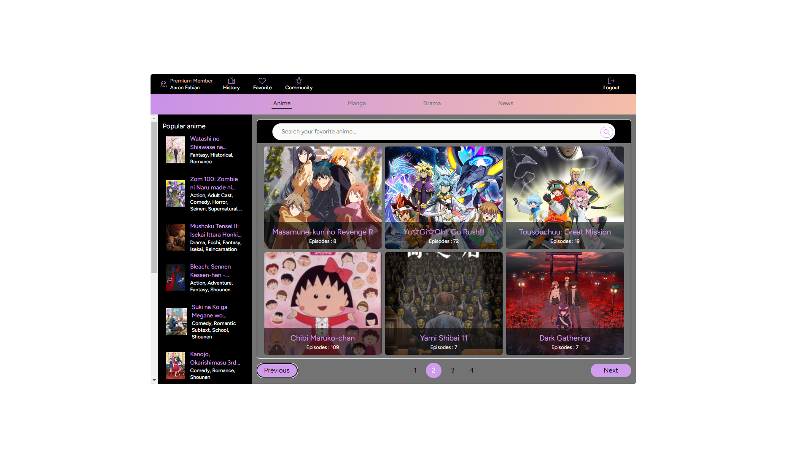
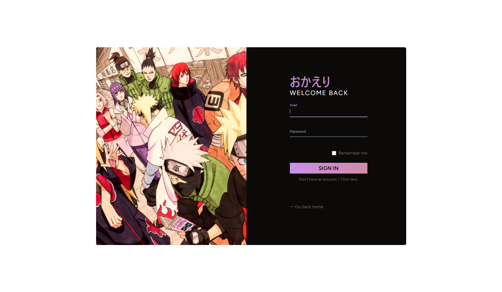
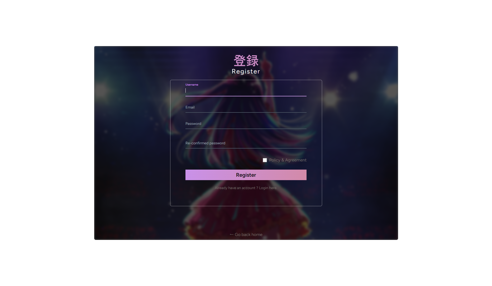
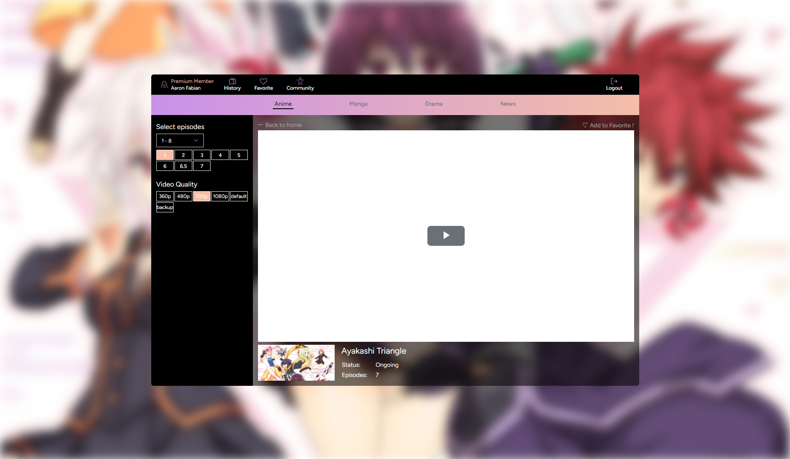
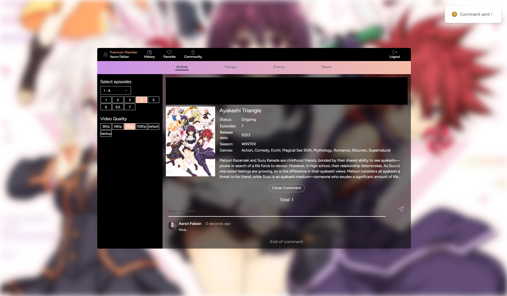
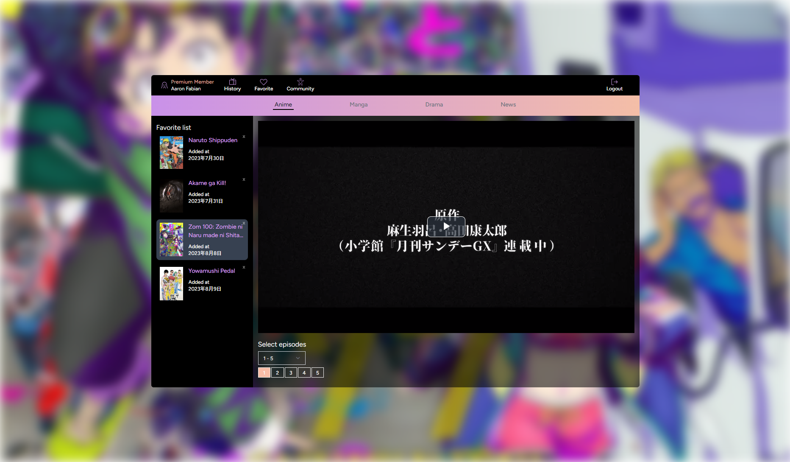

# Orange Juice
A simple anime streaming website, built with react.js and laravel. Aiming for every user and user experience.

## Techologies

- Axios
- HTML
- CSS
- JavaScript
- Inertia.js
- Laravel
- MySQL
- React.js
- React Icons
- React Hot Toast
- PHP
- Tailwind.css
- Video.js
- Vite

## Link Website

https://ice-chocolate.com

## Screenshot
| Main Page                           |
| --------------------------------------- |
|  |

| Login Page                           |
| ------------------------------------ |
|  |

| Register Page                           |
| ---------------------------------------- |
|  |

| Streaming Page                           |
| ------------------------------------- |
|  |

| Streaming Page (comment section)                           |
| ------------------------------------ |
|  |

| Favorite Page                           |
| --------------------------------------- |
|  |

## Installation

Clone and move to the repository

```bash
# important
don't forget to setup your mysql and .env

git clone https://github.com/AaronFabian/orange-juice.git
cd orange-juice

# install packages
composer install; (backend terminal)
npm i; (frontend terminal)

# create the database
php artisan migrate:fresh;

# run the server
php artisan serve; (backend terminal)
npm run dev; (frontend terminal)

```
